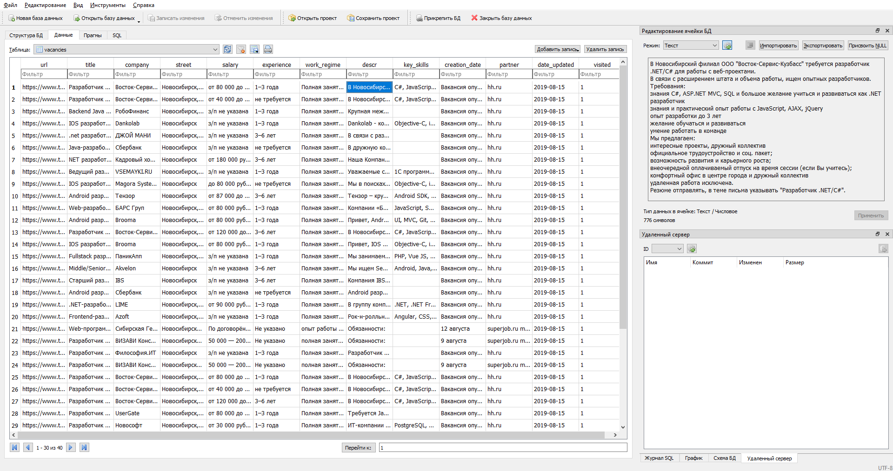

trud-parse
==========

Соберите вакансии сразу с [hh](hh.ru), [superjob](superjob.ru) и даже, может быть, с [talents.yandex](talents.yandex.ru)
за на несколько минут работы скрипта и просматривайте доступную информацию в одном окне
без необходимости прокликивать каждую в отдельности, ожидая, пока она загрузится.

Пример вывода программы (в обозревателе баз данных [DB Browser for SQLite](https://sqlitebrowser.org))

Установка
---------

Чтобы запустить программу, установите `selenium` с помощью `pip` или `conda`.

Затем скачайте [веб-драйвер](https://www.seleniumhq.org/download/) для вашего браузера и положите его в папку со скриптом или добавьте папку с драйвером в переменную окружения PATH.

Просмотр результатов
--------------------

В результате работы программы в папке со скриптом будет лежать файл "vacancies.sqlite". Воспользуйтесь
удобным для вас способом просмотра содержимого этого файла.
